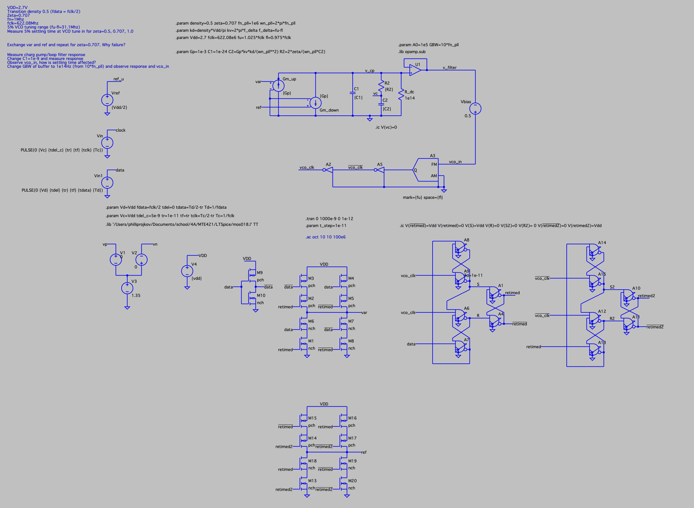
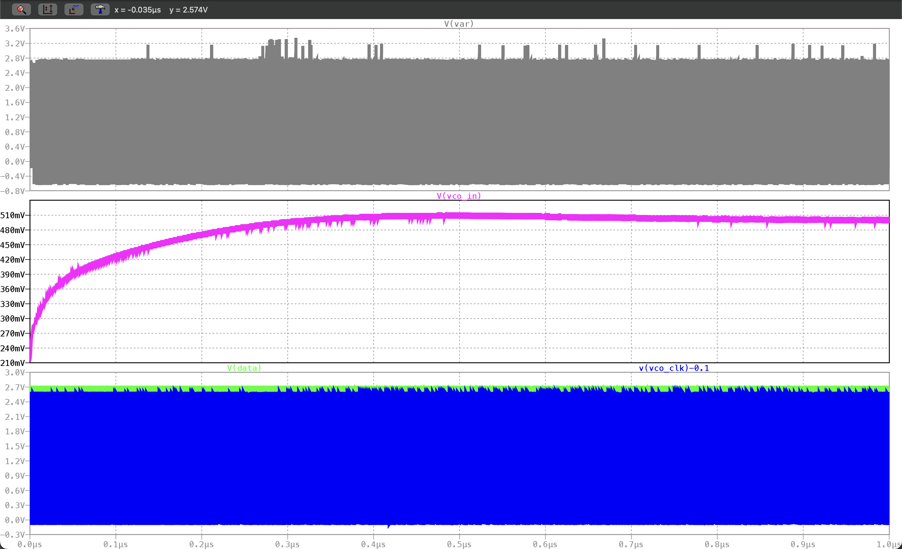

# portfolio
projkov@uwaterloo.ca
rojkovphillip@gmail.com
https://www.linkedin.com/in/phillip-rojkov/

# Laundry folding capstone FABRIQ

  

[Full video](fabriq/folding.mov)

[Public Onshape Link](https://cad.onshape.com/documents/496138d32451a37043e1de6e/w/243f7f1cecadb00b49139785/e/d179321f5ef1c8fa17bde102)

[Poster](fabriq/poster.pdf)

[Design Log](	
https://www.figma.com/design/JUPeqzdHDSUxGAiuWrIxmC/Group-48-Capstone-Design-Log?node-id=0-1&p=f)

My work (see ./fabriq - not all files present):
- Mechanical design/construction
- Electrical
- Firmware (arduino)
- Python interface (serial, ikm, move abstraction, test script)

# PLL Design/Sim in LTSpice (MTE421)
   
- DFlipFlop design with fets and logic blocks
- XOR gate with fets
- Charge pump loop filter
- All integrated into PLL circuit

# Stewart Platform (MTE380)

  

[Full video](platform/platform.mov)

[Onshape] (https://cad.onshape.com/documents/0d139236b3764ea57d5cb798/w/9206d11131af0e21cf592587/e/a38cbd91f123258eae9a3726?renderMode=0&uiState=69c43fde07ede44da18b0bd7)

- Mechanical design
- Firmware
